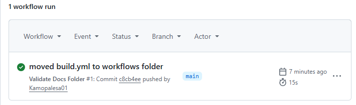

# RaceDay - Event Management System

## System Overview
RaceDay is a full-stack web application designed for the South African road running, walking, and cycling community. The platform allows Event Organisers to create and manage events, categories, and participant results, while Participants can browse upcoming events, enter events, track their personal performance history, and prepare for race day using live weather and route information.

## User Roles
- **Organiser**: Can create, edit, and delete events, manage event categories, capture participant results, and view all event enrolments.
- **Participant**: Can create an account, browse events, enter an event by selecting a category, view their own enrolments, and track their personal results.

## CI/CD Build Status

## Setup Instructions
1. Clone this repository to your local machine.
2. Open **SQL Server Management Studio (SSMS)**.
3. Connect to your SQL Server instance (e.g., `localhost\SQLEXPRESS`).
4. Open the `/docs/RaceDayDB.sql` file in SSMS.
5. Execute the script (press **F5** or click the **Execute** button).
6. Verify that the database `RaceDayDB` was created successfully with sample data.

## Repository Structure
/
├── docs/
│ ├── ERD.png # Entity Relationship Diagram (Section A)
│ ├── EndpointPlan.md # API Endpoint Plan (Section B)
│ └── RaceDayDB.sql # SQL Database Script (Section C)
├── .github/
│ └── workflows/
│ └── build.yml # GitHub Actions CI/CD Workflow
├── README.md
└── green-build.png # CI/CD Success Screenshot

text

## Database Schema
The database consists of the following tables:
- **Users** - Stores all user accounts (Organisers and Participants)
- **Events** - Stores event details created by organisers
- **Categories** - Stores event categories (e.g., 5km, 10km, Half-Marathon)
- **Enrolments** - Links participants to events and categories
- **Results** - Stores participant race results
- **AuditLog** - Tracks changes to the database (optional)

## Video Walkthrough
[Watch the walkthrough here](https://www.youtube.com/watch?v=YOUR_VIDEO_ID)

## Technologies Used
- **Backend**: ASP.NET Core Web API (C#)
- **Database**: Microsoft SQL Server with Entity Framework Core
- **Frontend**: ASP.NET Core MVC with Razor Views
- **CI/CD**: GitHub Actions for automated builds
- **Containerization**: Docker (Part 3)
- **Database**: Microsoft SQL Server
- **Backend API**: C# / ASP.NET Core (Part 2)
- **Frontend**: MVC Web Application (Part 3)
- **Containerization**: Docker (Part 3)
- **CI/CD**: GitHub Actions
- **Version Control**: Git / GitHub

## Author
Kamogelo Palesa Masiapata

## Date
01 September 2026
